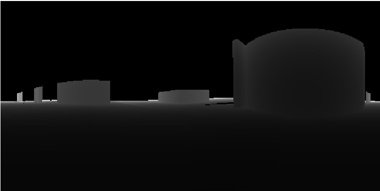

# gsv_panometa
This light package is used to obtain depthmap of Google Street View. Please refer to this greate post:

 [Creating point clouds with Google Street View](https://medium.com/@nocomputer/creating-point-clouds-with-google-street-view-185faad9d4ee). 

Most code comes from here:

[Convert depth map (base64) of google street view to image](https://stackoverflow.com/questions/52790436/convert-depth-map-base64-of-google-street-view-to-image)

# How to use

Put gsv.panometa.py in the a folder, then follow the code below:

```python
import gsv_panometa as gsv
import os

# determine a location
lon = -77.072465
lat = 38.985399

# get the ID of the nearest panorama
panoId = gsv.getPanoId(lon, lat)

# set the saving path
saved_path = os.getcwd()

# get the depthmap
if gsv.getDepthmap_from_panoId(panoId, saved_path):
    print(f"Processed panorama {panoId}!\nTest passed!")
else:
    print("Test failed!")
```
A depthmap will be saved in the current folder, the unit is meter:


As well as a json file containing metadata of the panorama:

```python
4ihNJmyotwUEr3NSq0EwhA.json

[[], [[[1], [2, "4ihNJmyotwUEr3NSq0EwhA"], [2, 2, [8192, 16384], [[[[256, 512]], [[512, 1024]], [[1024, 2048]], [[2048, 4096]], [[4096, 8192]], [[8192, 16384]]], [512, 512]], null, null, null, null, null, "4ihNJmyotwUEr3NSq0EwhA"], [null, null, [["3698 Woodbine St", "en"], ["\u5207\u7ef4\u8521\u65af, \u9a6c\u91cc\u5170\u5dde", "zh"]]], [[[["\u00a9 2020 Google"]]], [[["Google"], "//www.google.com/streetview", "//lh5.googleusercontent.com/-B45RREcFXCo/AAAAAAAAAAI/AAAAAAAAAAA/Z6DH8qvKlJ0/s48-p-k-no-mo/p.jpg"]]], [[[1], [[null, null, 38.98541904960352, -77.0723947809381], [100.4134826660156], [264.96923828125, 90.7411117553711, 0.4940275847911835], null, "US"], null, [[[[2, "4ihNJmyotwUEr3NSq0EwhA"], null, [[null, null, 38.98541904960352, -77.0723947809381], [100.4134826660156], [264.96923828125, 90.7411117553711, 0.4940275847911835]]], [[2, "bZWnS6Wq-OUBKp8enwcD0Q"], null, [[null, null, 38.98541318201342, -77.07250785481281], [100.5664215087891], [274.3340454101562, 91.11510467529297, 358.8960571289062]], [null, null, [["Woodbine St", "en"]]]], [[2, "4ZhygTmaA_ADYldltqmUDA"], null, [[null, null, 38.98542569455353, -77.07229185801998], [100.1453475952148], [264.5933227539062, 91.33769989013672, 0.6136537194252014]], [null, null, [["Woodbine St", "en"]]]], [[2, "1_LEWPWwTwKBqDXQODfRmA"], null, [[null, null, 38.98520042491224, -77.0726474513006], [100.5474548339844], [354.4374694824219, 89.83924865722656, 0.8290116786956787]]], [[2, "3R4ccScj0Qy8rJSZ62bkrg"], null, [[null, null, 38.98530187145385, -77.07324561053052], [97.76470184326172], [266.4104919433594, 85.02545928955078, 1.37694525718689]]], [[2, "58c0i5jnVcLg1XHwrAQ3wQ"], null, [[null, null, 38.98553066021748, -77.07258211031971], [101.0697479248047], [20.46921730041504, 90.36436462402344, 1.031177043914795]]], [[2, "8Ewd5Psxsfty6Q0-Opl_Hw"], null, [[null, null, 38.98544097234051, -77.07206603605812], [99.21775817871094], [262.9307250976562, 93.54432678222656, 0.01956977695226669]]], [[2, "Gdnxed6n4mQyaWN8bBrK-w"], null, [[null, null, 38.98543328474015, -77.07218171014493], [99.80088806152344], [265.0554809570312, 92.25341796875, 0.9409940838813782]]], [[2, "Pft_Rmgo99aKdDyydHvvPg"], null, [[null, null, 38.98531407392797, -77.07270090478609], [101.3047714233398], [306.87939453125, 90.23739624023438, 1.004638433456421]]], [[2, "RlSk13VgPxOVwPVMEzFGGQ"], null, [[null, null, 38.98677088514454, -77.07251969735282], [98.33507537841797], [269.4340515136719, 87.98722839355469, 359.5425720214844]]], [[2, "UfRJafuWr2AI5gnJXVZAQw"], null, [[null, null, 38.98561681421964, -77.07253192976039], [101.1198043823242], [26.13766860961914, 90.45475006103516, 0.9654499292373657]]], [[2, "W4GTUz9EY-rUh42yTQA59A"], null, [[null, null, 38.98507375484419, -77.07262515668829], [100.7112274169922], [349.2753601074219, 89.51272583007812, 0.2254532128572464]]], [[2, "XRmaNjZZ6tbU3EAToF64mQ"], null, [[null, null, 38.98530631967645, -77.07285960068667], [100.519775390625], [84.78433990478516, 94.3017807006836, 1.903332591056824]]], [[2, "f5NsjdDVk4P_YglIybOePQ"], null, [[null, null, 38.98543538227002, -77.07262629468418], [101.0501861572266], [19.81117630004883, 90.41294860839844, 0.6159158945083618]]], [[2, "fyUxtQ4h1x1orv3t8AoCMg"], null, [[null, null, 38.98531018976845, -77.07300193659457], [99.51024627685547], [265.4883422851562, 85.27973937988281, 0.6729742884635925]]], [[2, "nQ5p9CZctCnB-LmjXUmLOw"], null, [[null, null, 38.98530790687024, -77.0731175586659], [98.68180084228516], [265.8579711914062, 84.95170593261719, 0.9629965424537659]]], [[2, "vesJlvL3lTkueyMvhNIaQQ"], null, [[null, null, 38.98545219810993, -77.07194758785913], [98.51725769042969], [262.27978515625, 94.35090637207031, 0.004229104146361351]]], [[2, "51FI56SHAWPN6nEVHei0ZQ"], null, [[null, null, 38.98525546884409, -77.07061117335816], [89.07222747802734], [286.6728820800781, 94.42156219482422, 359.1399230957031]]], [[2, "7sYEUuuiTs1rkNrbq8TK7A"], null, [[null, null, 38.98546452946231, -77.07172479595371], [97.0076675415039], [270.538818359375, 93.99923706054688, 0.8260796070098877]]], [[2, "DlfzqN8CJ4B6xICmWv40tQ"], null, [[null, null, 38.98467809361571, -77.07175535931758], [99.57117462158203], [82.78804779052734, 87.76152038574219, 1.122335314750671]]], [[2, "GH7-CqaDXjlU67R7GRh-Cg"], null, [[null, null, 38.98543690146181, -77.07137763925039], [94.6558609008789], [282.19873046875, 94.7680435180664, 0.3797870576381683]]], [[2, "Gy_l8uynB0nYynogo1M5lA"], null, [[null, null, 38.98546206635986, -77.07183461317712], [97.74675750732422], [266.0775146484375, 93.96680450439453, 0.4178300499916077]]], [[2, "J0l_GJJO-rSxsRwrpCw8dQ"], null, [[null, null, 38.98539034174163, -77.07115963343911], [93.06969451904297], [286.6335144042969, 94.27965545654297, 359.6748352050781]]], [[2, "Kjq79f2wzoBF4qXd1CaYmA"], null, [[null, null, 38.98468964689341, -77.07163669410656], [99.05438995361328], [82.56024932861328, 86.82396697998047, 0.8407100439071655]]], [[2, "Y5A9HfA5ucXMVzVh7oIhMQ"], null, [[null, null, 38.98528252766384, -77.0707202773314], [89.8818588256836], [287.2979736328125, 94.26403045654297, 359.5709228515625]]], [[2, "hgX1lg6W6Xn7kXUJ4W6yhg"], null, [[null, null, 38.98531025524563, -77.07083001168863], [90.66181945800781], [287.6220703125, 94.17654418945312, 359.9075317382812]]], [[2, "jpqz9GeFAv_tWVjyz3QppQ"], null, [[null, null, 38.98541506247064, -77.0712664960249], [93.84628295898438], [285.3382568359375, 94.11825561523438, 0.1472596228122711]]], [[2, "moNNanuAbABdLMs1d_r97A"], null, [[null, null, 38.98523086381874, -77.0705018952144], [88.27467346191406], [285.3124389648438, 94.61289978027344, 359.8904113769531]]], [[2, "rk6EZnRHDh45J78gYkf0Yw"], null, [[null, null, 38.98546062673435, -77.07160969307517], [96.2372817993164], [273.3958740234375, 94.40554809570312, 359.4991760253906]]], [[2, "td4DBEhlnL-QchIh5rb7PA"], null, [[null, null, 38.98534818727961, -77.07099892185038], [91.84314727783203], [108.7835235595703, 85.1463851928711, 359.96630859375]]], [[2, "yvX9ZVnCq6f_7AqI--1ang"], null, [[null, null, 38.98489381911295, -77.07257500228742], [100.7437057495117], [346.934814453125, 89.80391693115234, 0.8449581861495972]]], [[2, "LfJf9-wRad1yWV9t44YI3w"], null, [[null, null, 38.98542357683078, -77.0723763032623], [100.8115158081055], [264.1514282226562, 91.50373840332031, 1.895695328712463]], [null, null, [["Woodbine St", "en"]]]], [[2, "nREPfiDaGj6zAnJFY_3DKA"], null, [[null, null, 38.98540722302896, -77.07237450978513], [100.9832763671875], [82.77124786376953, 88.69852447509766, 0.06494646519422531]], [null, null, [["Woodbine St", "en"]]]], [[2, "E3NfuB7tA9EBLbHGURewxQ"], null, [[null, null, 38.98539241764417, -77.07241438653071], [100.95703125], [84.28044128417969, 89.29448699951172, 0.6452890038490295]], [null, null, [["Woodbine St", "en"]]]]]], null, [[2], [[], 1, "eJztndtS4loURb+IKhQ04THhGi6SIBzFl5QidxUFIcDXn0CrREkCgYTFSuY8NV7aC4u959ljg3Z1OmNIkqRIktaVEARBEARBEARBEARBEARBEARBEARBEARBEARBEARBEARBEARBEARBEARBEARBEARBEARBEARBEARBEARBEARBEARBEARBEARBEASJXNJSV/EA9bhItOKlmy4gSFDxo5/oLBJcgukn7gaInzlJR9FX5JicuqPoK3JAyDqKviJ75ww6agFBbHMG3dyGelGQcwt9J3G2IrtD3UWcrcjuUHcQZyuyT+j75wnq5UKIcgbd8wz1miG+Z1SSd51B9L07DCREGZXS3VFe7jadP4W6b0dxupVEgsy6pyZN566Sd+1oTrukSCD519OV/x26St8zdBVZ5etMXft/ze8Pk3fMPxDm+eX/P109g36hq8hX/vjf2lX6bvlLlXShkWOz5f+frtJ3y2eSxEuNHJdt/6+7St4r/8ngPSvWsfO/CXmvAgD+5x1b/8v0vQqAJLrKOlHyP+6qnBMl/+Ouyjol+66S9yoA4H/eGdm/V0XeK/+B/3nn+0xNw//IeSdS/kdXOSdS/sddlXGi5X/cVRnHwf9h7Cr8zzv2/g/jXRX+5x0H/4fxrgr/8w78jzAJ/I/wCPyPcAn8jzAJ/I8wCfyP8Aj8jzAJ/I8wCfyP8Aj8jzAJ/I8wCfyP8Aj8jzAJ/I8wCfyP8Aj8jzAJ/I8wCfyP8Aj8jzAJ/I8wCfyP8Aj8jzAJ/I8wCfyP8Aj8jzAJ/I8wCfyP8Aj8jzAJ/I8wCfyP8Aj8jzAJ/I8wCfx/vmnkZM0R6uFOHvj/bOLWyz2hfgqBBv6njQ/93ED9ZIIN/E8RP/sZlTsB/H/SBNFP+D9knIP/g+0p/B8SzsH/AZ+p8H84OAf/B3umRsT/of+3qk/mf1lx/hD8f0Qi829Vn8L/t9mecpt1Prvh/yMSnX+rOlj/rzv6hfNnwf9HBP4/PqsFu7V01fET4f9jAv8fnfWibc5U+D+YwP/HZ7VgEfZ/OW1MvvC8KV4eB/4/PpH0/6afFrxvjIdHhP+PToT8b9vPDQdsjIfHjpb/747aKLl1b/fH4fe/az+P8b+zgLbj4P/wdXXtf7l5aFcfc/PWvYndx8Lu/z17SuP/EN5V1/7P9Zp3Oe+vrR7zvdH9uquGzUdD7/99z1QS/4fwrvrP/+uu9pretkoemV1dn6mR9P/eZyr87wvf/j/kXDXPVPgf/j8VG//3ft9Xld1nEfwP/58QB/+nld7OrsL/8P8JcfK/0s/2rAtSTG9vOPwP/58Qe/+nlb7ZLuuCDIvbiwT/B+7/oXlEDIsFefKUn9sSj7r/zab+9r+5YFtbBf8H5v9VP7eoGa2CbLT+dDXq/u/77n8XpcH/W2z39E9fv8kb8L+T/8v9n98X8OR/y6MOlEXFWlAO/rfpTZD+d+jphp+uRsr/g+G3/99L/dFHpfvl/3p2Xuw3X1eUb+PvpVtjUrxtvJis9u7C6v/1YmUqS+t3/uP/7RKlJ1pWlrSCEbD/a9lf/2UkY1cP9uPU/nfoa5T8X51/+b/feisuTJaSUe2LM7Ojz4Va3BbzXBysmSfbhV6ybVOSP6//13+27ua6n3OxUzBENWMStP/Nh/vTVvM/zaiYna0c2Vd//X/YDFHyf+Pb/6vO/eZI8X710trPzFc/v3jI14ZB+//74R37+g8fzln7O4HD4h/zONarSYT839PMnjpt8p6F+HL5Npuz8xfz4aqja76qEqD/K79G2uprLWvpq5+9/b4nuLxG8tzL7UTJ//YdW6O6fMwWq9dt+OlnXrOpxyFoWZeeZs3bduUfxp9R5e3GujyQf73dH5d2xm8y2g9R8r9Tr1a49bJj9tLta3/46Wdt6E8/N+z+v6dW+e6r3SfsuBM4E0w/f8po7eIOIuT/rnPHstJ+XTxxPy3sddo7n63OdwK3MzYIPHTzN/D/Pzz28+/9M3j2vZm4n61Hn7FHc2BPHf0v0XfLZ1b+d9vh8+vmbzzdpHedrW732EA7e3hPbfy/eR5n0C8fcT9TLf4/gcsPweOrvs3ZWt/nC05yLziip5ZZS9aOWjiDjvmDeab+W7K57WadQRd34KWnXs/WU5yzx/VzX8h75gNV8q4dxwHbtsbT2brzPnvYWeulnwc9yd+Qd+1IyLt2JEds3X6vsw47b3d3d0c3j+1l2PpK3TMfOHLrDroLsIe6d56g75g/+LF1x9wFGEPewd3Q9+vcuurfXYAh5H0Mq++38G/bfu4CEeyrfDbvEVD3KUD83bKdP38NP3B9QASxXdHuq9FCRwMhsC2Lal+tf70QnveTYLcugn21/lVYyx/j/DyWU2xftPpq+WvbR36r/3K1xpoz6MkZcLotjMj7A1b/H//tvrqa8+vve3Dm1Fvp8fey+OHg/8PB2foPsi21nLHh6qx//t+AszVzSv8770OoOuuv/y1E/mwl31rn3vK80/rufyvfdwH63pwe+q31DvkArgThfyuRvQvQb613yAdwI8gz9YdcFPtKvrXeIR/AlYDPVJu+knfoNNBvrXfIB3AloNdUDkTofSz6rfUO+QBunMT/kewr+dZ6h3wAV07n/7+E/P5Kv7XeIR/AldP6f5vvvobu/Sz6rfUO+QBuUPjfltCdseRb6x3yAVyh878jm3PW+S57/n2mX0fvkA/gCrX/D4W+izs4gzXyDPkAbpyN/z1yBl2E/0/LGfp/L86gi/D/aYH/4f8fyAdwIdDfqQqSM+gi/H9Sgv6dqsA4gy7C/6cksN+pDhz6LsL/JwX+R1c3kA/gBvwfHORr5BnyAVyA/4ODfo08Qz6AC/A//L+BfAA34H/4fwP5AC7A//C/BfIBXID/4f8N5AO4Af/D/xvIB3AB/of/LZAP4AL8D/9vIB/ADa5nKvwfBOQDuMD1TIX/A4F8ABe4vqaC/4OAfAA34H/4fwP5AC7A//C/BfIBXID/4f8N5AO4Af/D/xvIB3AB/of/LZAP4Azbn6nC/0FAPoAzfH+mysH//LpKPoAzbH+mysH/DO+q5AM4A/8HCfUaeYZ8AGfgf/jfCvkAzsD/8L8V8gGcgf/hfwvkAzgD/8P/VsgHcIbtmQr/BwL5AM6wPVPh/yAgH8AZvq+p4P8gIB/AGfgf/rdCPoAz8D/8b4F8AEcYv6cK/wcB+QCO8H1PlYf/2XWVfAAnGL+nysL/7O6q5AM4Av8HzBmskyfIB3AE/of/f0E+gBPwP/z/C/IBHGF8psL/QUA+gCN8z1T4PxDIB3CC8Wsq+D8IyAdwgvNrKh7+59ZV8gEc4Pyaion/ud1VyQdwgPN7qkz8z2xdyQdwAv6H/39DPoADnM9U+D8QyAdwgPOZCv8HAfkATnB+TcXF/7y6Sj6APaxfU3HxP7O7KvkA9rB+TcXF/7zuquQD2MP7TIX/g4B8AHtYn6nwfyCQD2AH759T8fE/q66SD2AL89dUbPzP6q5KPoAtvM9UPv5ndQ6QD2AH8zOVkf8ZrS/5AHbwfp9KZuR/TndV8gFs4H6mMvI/p7sq+QDbsD9TOfmfT1fJB9iG+/tUMiv/8/EW+QDbsD9TOfmfUVfJB/hLCM5UZl2lXqs9IR/gL/zvqSvo+xe+rpIP8Af+r/3XnEH/QtdV8gF+E44zlZf/mXSVfIBfcP+5/w/03QtfV8kHsBCO11NrzqB7oesq+QAbwuL+FdS9C2FXyQf4IUQ95ej/NeTr5gb5AH97yvyO+gV15w7mDNbOCfIBQtjTLE//f0O9dvaQDxAy739D37fQna3EA4Tm9f5fyLsWur7SPXgoz9IN9D3zkTNYTwr/h+n9qMh09RzO2ZP3k75Dp4G6U2E7c4P4puF7LY+u+ssB67nfJ0bE10FA3YmwQL2P0YJ+v3lBvV8RQbKJnDGUaVfVKv1ZZSl2BPFDkd+l5NONoaakxHiclMW4IeYrhQdNehAbT7PLxWNXNDo5fXYRj+Wz8tM0romXw54+FTvXHUGfZnoPUmva02eLcj9enn/Etba4/IzVtcflXaV83VEKht5OF99n6crjNCtX3q5LL6/L2ZXabjU749hg0HuRtGp+PhtruVZGLC8LbbFVq75ozYKiL+fjxH958SP1bj6+kZPjaaOdEPVmrS2rT3NZX37W8rOidD0af6iD0k1zGUveddrCZyKvaLcjTV4m5oVRUxymbvTZtfipxNMfj/cV8Vl4a6vKuNsRYvNp/0X6LPZENXVTKg6EezGVFbLCZUK9KtzqT9NM4VkSk6vnd9VQc9m0PuzHhPHbaKA2l2Xz6+MJoygJxuutWuorr0/xgXof0xuFck1N3Hc7Zf0uXxNji8JoMss83PwXzyWVQVzMLN6U2fNS7oz1y0Ksq78I17NqIi3eL+OJN/Pr54WnOzUpLErC53AxMFJK2Xz+KVXLNtI5/V7UM8ZiVJ11YpnMPLNIPUvT52RtFsu1G+NU7L/xRKgZtbQ2vkp0xqnX5XMypdwbg1m21LnL5uvLRloQlvWbWbozXs0v1FPSc/I5NhMucpeDRCmTroqFmNbWOi/lUib+oQ1K4nxSM/c3JhcaUr81UUT9QZhMU3Xz68WLifEpXS/EeDX1/Npexue9QkxfNEpXqhDTpcxSWypG6vq1qM+M7NPQ3N+Lzofwcjs11NuhuX66Ubjq6olpKjVtP0zmTwll+XatP15Nalrzsvw0iBU/y6+xXvJGU8viSB0WE6XSNPY+LM5nV7FMPmNUlqliumc0P1U11sk9XT7GzceX8o8JrdK++W8QG7x2p3qy8/6uVq+VUaOUFfutVFwqJtXmu2Y+f00VFV2tqmW1XHjp1C/7T+b6J4q3oip0U9eZ2WO+1E9VzWWfzcXlTbYg3ygtoW6MzQ0bmP3R72rKXDaW0pN6/5DuDC4SjbeYLrerC9VQrj4G897dvCuMVfPrF5ORHs+Irdy18NBS5+qdcmHuz7x9IcUqt/GxWr94bQ4ukk3z6xvJSlarSpl0Jv5ycd9NzS7N9RPqy0UmJT/nRH0hzK5mk7bRHMyv5ncv6cT14Eotzm97mUv1znz+n6VpTxVG90Jm8SEoSurj4kqfXWaW78vY8l2TUqO21laLTy3z+Wdjck2uzZsL9WF531pezurm88/1ZhVVmNc+x9OUnEim4knZ3L+72WcmJk1i4vXyoV+oXtR1c/9LyWpTT7S7l6rWuWrWLxN35vzjwqSkycOH+iD+nMo3U6+NVX86b9dLXbu5aKQuexdDtfEpm+t3/5+q6M2KNFU7k09z/lo1EdNvxzlDvbgSeoP5WBop4vXUnH/+Wp6aG5eODcV05eZBbeUV8+sXgvYgKQvhsTqr1wdPnxXd/Pp6IRbXpP8B/OAWmA=="], [1], [[256, 512], 1]], [[2, [null, null, null, 85.25196075439453]], [1, [null, null, null, 266.1806945800781]]], null, [[31, [2009, 7]], [32, [2012, 3]], [33, [2018, 8]]], null, null, null, [[[[[null, ["9923621380348688989", "12642772211405642419"]], null, ["Woodbine St", "en"]]], [85.25196075439453, 266.1806945800781]]]]], [3, 4, 1, null, null, [null, null, null, [6]], null, [2019, 6]], ["//www.google.com/cbk?cb_client=maps_sv.tactile&output=report&image_key=!1e2!2s4ihNJmyotwUEr3NSq0EwhA"], null, null, null, null, []]]]
```

# Dependencies

- Numpy

- requests

# Copy right
Google Street View has all the copy right of its data. No any commerial use for this repository.
